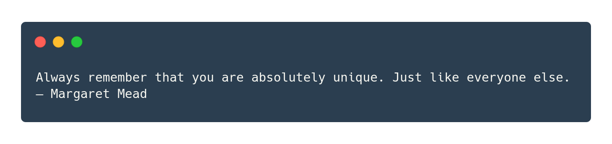

# 🔊 Bol

An [`oh-my-zsh`](https://github.com/robbyrussell/oh-my-zsh) plugin, that prints a random quote when you open a terminal.



## 💽 How to install

1. Clone this repository in `oh-my-zsh` custom plugins directory:

```bash
git clone https://github.com/ikhurramraza/bol ${ZSH_CUSTOM:-~/.oh-my-zsh/custom}/plugins/bol
```

2. Add the plugin to the list of plugins inside `~/.zshrc`:

```bash

plugins=(bol)
```

3. Start a new terminal session.

## 📖 Usage

This plugin comes with a CLI to perform simple tasks.

#### 🆘 Help

Each subcommand comes with its own `help` subcommand. That defines the usage and options with examples.

#### ➕ Add a quote

A new quote can be added using the `bol add` command.

```bash
Usage: bol add <name> <quote> [options]

Examples:
bol add bad-code "Code is like humor. If you have to explain it, it’s bad."
bol add bad-code "Code is like humor. If you have to explain it, it’s bad." --author "Cory House"
```
